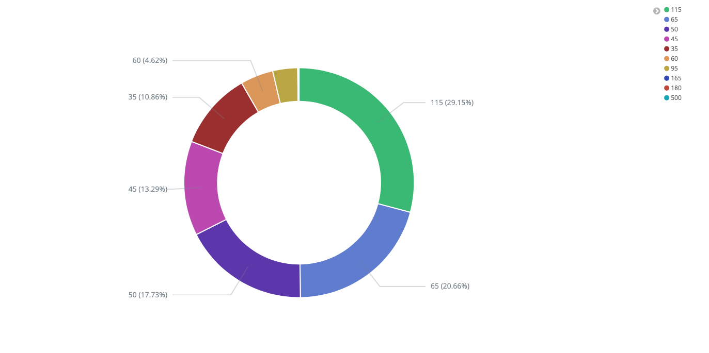
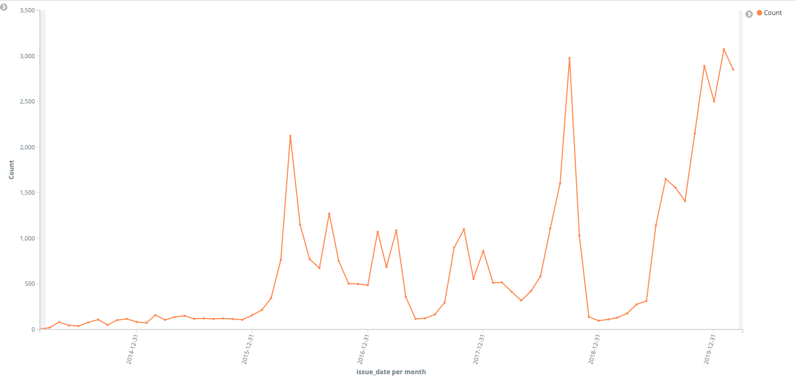
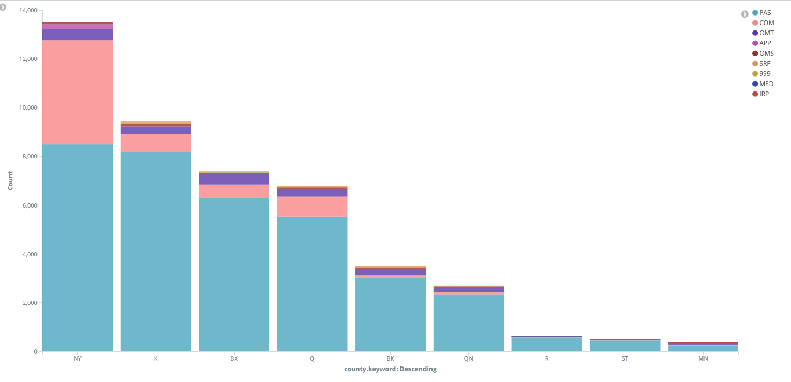
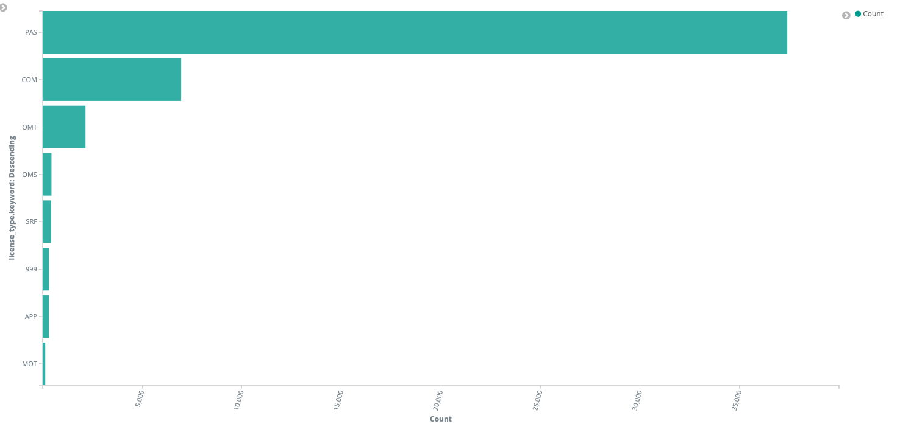
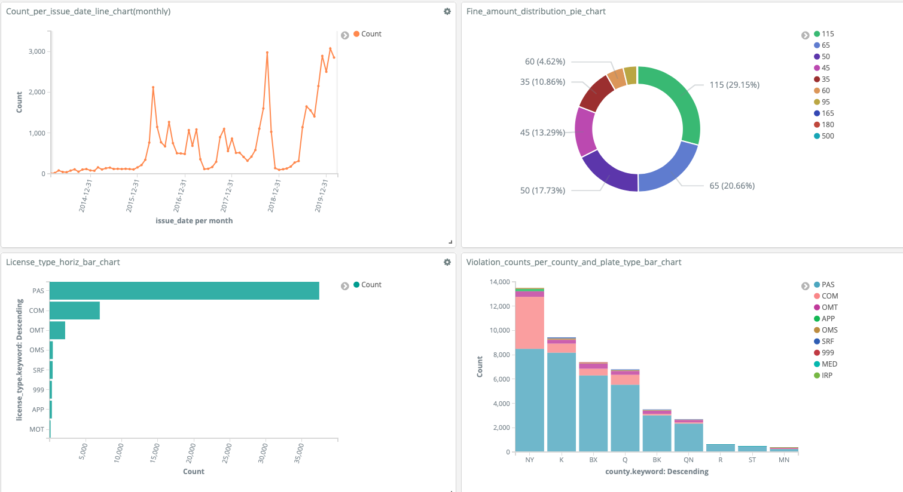

# cis9760_bigdata1.2
### Project1_Part2
 - Copied all files from Part1
### Build docker file
 - docker-compose build bigdata1.2
### Run docker file
 - docker-compose run -e APP_KEY={App token} bigdata1.2 python main.py --page_size={input for number of records per page} --num_page={input for number of pages per run} --output={filename.format}
### Output
The output is json formatted.

### ElasticSearch
Data available in elasticsearch; 
- URL: localhost:9200

### Kibana 
It is also available in Kibana for visualization; 
- URL: localhost:5601

Examples of Visuals from Kibana

- Fine amounts distribution

- Tickets by issue date (monthly)

- Tickets by county / plate types

- Tickets per plate type

- Dashboard of visuals

